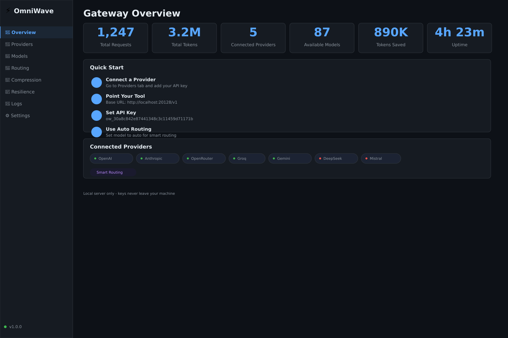
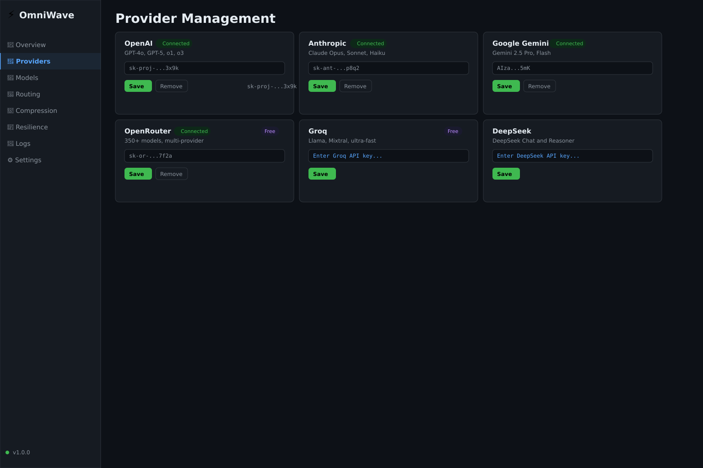
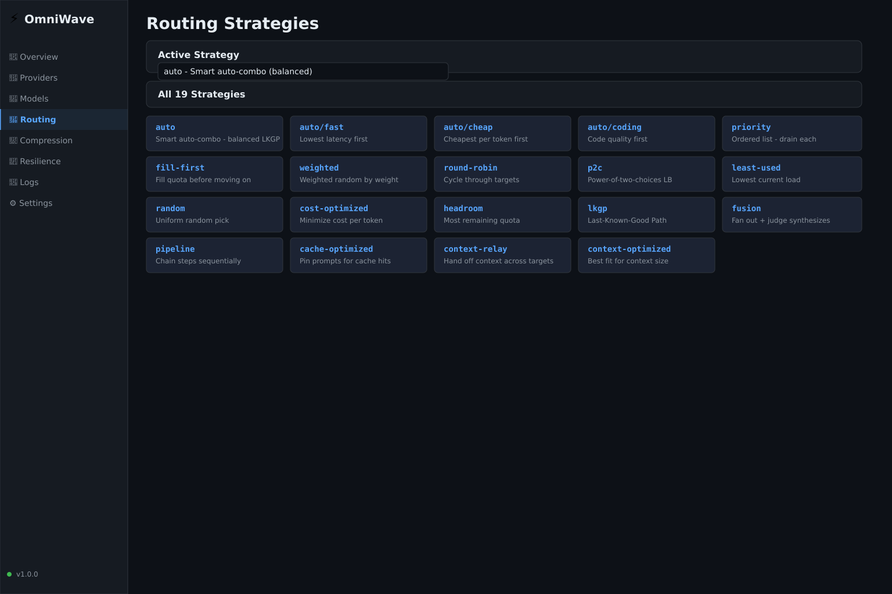
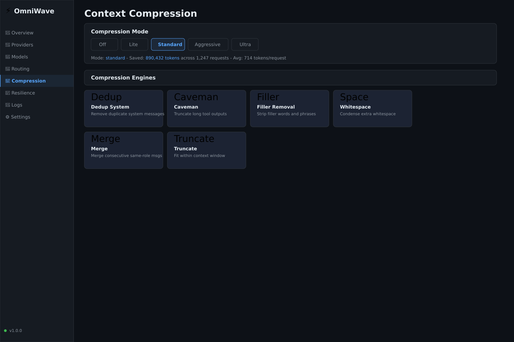

# ⚡ OmniWave Gateway

**Free AI Gateway**
## Screenshots

### Dashboard Overview


### Provider Management


### Routing Strategies


### Context Compression


---

 — Route across 350+ LLM providers through one OpenAI-compatible endpoint with automatic fallback, context compression, and 19 routing strategies.

> Inspired by [OmniRoute](https://omniroute.online) · MIT Licensed

## Features

- 🔀 **19 Routing Strategies** — priority, weighted, round-robin, auto-combo, and more
- 🤖 **Auto-Combo** — `auto`, `auto/fast`, `auto/cheap`, `auto/coding`, `auto/offline`
- 🌐 **350+ Providers** — OpenAI, Anthropic, Gemini, OpenRouter, Groq, DeepSeek, Mistral, Together, and 10+ more
- 🗜️ **Context Compression** — 6-engine pipeline: dedup, caveman, filler, whitespace, merge, truncate
- 🛡️ **3-Layer Resilience** — Circuit breaker, connection cooldown, model lockout
- 🔐 **Encrypted Keys** — AES-256-GCM at rest
- 📊 **Dashboard** — Full web UI with provider management, routing, compression, logs
- 🖥️ **CLI** — Terminal management tool
- 🐳 **Docker** — One-command deployment
- ⚡ **Streaming** — SSE streaming support
- 🔗 **OpenAI Compatible** — Drop-in replacement for `/v1`

## Quick Start

```bash
# Install
./install.sh

# Or manually
npm install && npm start

# Dashboard at http://localhost:20128
```

## Connect Your Tools

Point any OpenAI-compatible tool at OmniWave:

```
Base URL:  http://localhost:20128/v1
API Key:   (from .env or dashboard)
Model:     auto          (smart routing — or any provider/model)
```

### Supported Integrations

| Tool | Config |
|------|--------|
| **Claude Code** | `export ANTHROPIC_BASE_URL=http://localhost:20128` |
| **Codex** | `export OPENAI_BASE_URL=http://localhost:20128/v1` |
| **Cursor** | Settings → OpenAI API URL → `http://localhost:20128/v1` |
| **Cline** | API Provider → OpenAI Compatible → `http://localhost:20128/v1` |
| **curl** | `curl http://localhost:20128/v1/chat/completions -H "Authorization: Bearer YOUR_KEY"` |

## CLI

```bash
omniwave status        # Gateway status
omniwave providers     # List providers
omniwave add           # Add API key
omniwave models        # List models
omniwave test          # Test connection
omniwave start         # Start gateway
```

## API Reference

### Chat Completions
```
POST /v1/chat/completions
```

### Models
```
GET /v1/models
```

### Responses API
```
POST /v1/responses
```

### Headers
- `X-OmniWave-Strategy` — Override routing strategy per request
- `X-OmniWave-Compression` — Override compression mode per request
- `X-OmniWave-Provider` (response) — Which provider served the request
- `X-OmniWave-Latency` (response) — Request latency in ms
- `X-OmniRoute-Compression` (response) — Compression stats

## Environment

| Variable | Default | Description |
|----------|---------|-------------|
| `PORT` | `20128` | Server port |
| `OMNIWAVE_KEY` | auto-generated | Gateway API key |

## Docker

```bash
docker compose up -d
# Or
docker run -d -p 20128:20128 -v omniwave-data:/app/data diegosouzapw/omniwave:latest
```

## Routing Strategies

| # | Strategy | Description |
|---|----------|-------------|
| 1 | `priority` | Ordered list — drain each before next |
| 2 | `fill-first` | Fill each target's quota fully |
| 3 | `weighted` | Weighted random by per-target weight |
| 4 | `round-robin` | Cycle through targets |
| 5 | `p2c` | Power-of-two-choices load balancing |
| 6 | `least-used` | Lowest current load |
| 7 | `random` | Uniform random |
| 8 | `strict-random` | Random without dedup |
| 9 | `cost-optimized` | Minimize cost per token |
| 10 | `headroom` | Most remaining quota |
| 11 | `reset-window` | Quota resets soonest |
| 12 | `reset-aware` | Rank by reset time |
| 13 | `context-relay` | Hand off context across targets |
| 14 | `context-optimized` | Best fit for context size |
| 15 | `cache-optimized` | Pin prompts for cache hits |
| 16 | `lkgp` | Last-Known-Good Path |
| 17 | `auto` | 15-factor live scoring |
| 18 | `fusion` | Fan out + judge |
| 19 | `pipeline` | Chain steps |

## Compression Modes

| Mode | Engines Active | Savings |
|------|---------------|---------|
| `off` | None | 0% |
| `lite` | Dedup, whitespace | 5-15% |
| `standard` | + Caveman | 15-40% |
| `aggressive` | + Filler, truncate | 40-70% |
| `ultra` | All engines max | 60-90% |

## License

MIT
